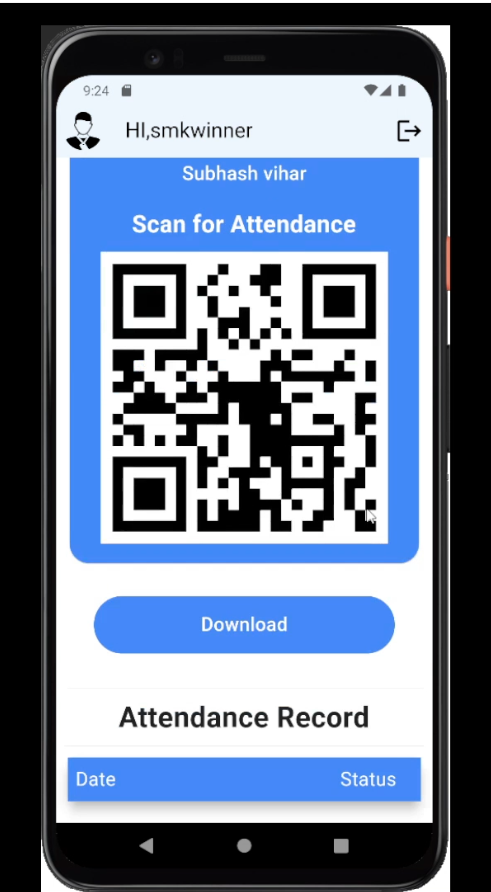

# UPASTHIT - Attendance Tracker 

This app has been developed to target to create a platform where An NGO or any other community can track attendance of their students/volunteers with the ease of technologies like QR Code scanning.

App has different roles like Student/volunteer,Member/Mentor and Admin role.

On the behalf their roles App will run in that flow.

# HOW TO BUILD

- Clone git repo
- Create new firebase project and replace required files.
- Add your SHA-1 Key to the firebase
- Run following command to build apk
   ```
  Flutter build apk --release
  ```
 - Run following command to build web
 
  ```
  Flutter build web --release
  
  ```

# OUTPUT

   
   
   


